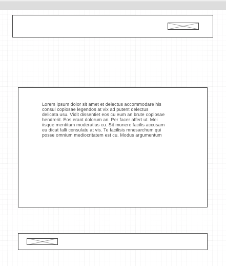

# Project 2: React Wacky Weather

 

#### Overview of Wacky-Weather

The question on everyones' mind "What's the weather today?" 

This weather app will not only give your numerical answer it will give you a chuckle to carry out your day. Well, a Giphy chuckle. 

All chuckles and observations are based on weather descriptions. 

#### My Wireframes :

#### My Challenges:
The logic, linking the weather temperature api and the GiF Api. This was going to to be a little more intensive than planned and I still needed to connect the APIs togther. My fix was to marry the weather descriptions with a descriptions in the Giphy API. 

Once the weather was generated I provided an option for the user. The additional option was to allow the user to just get the weather and or to GIF or not to GIF with the "Giphy Your City" link.

Get the weather with a little smile. Enjoy the day with a little Wacky Weather! 
# wacky_weather
